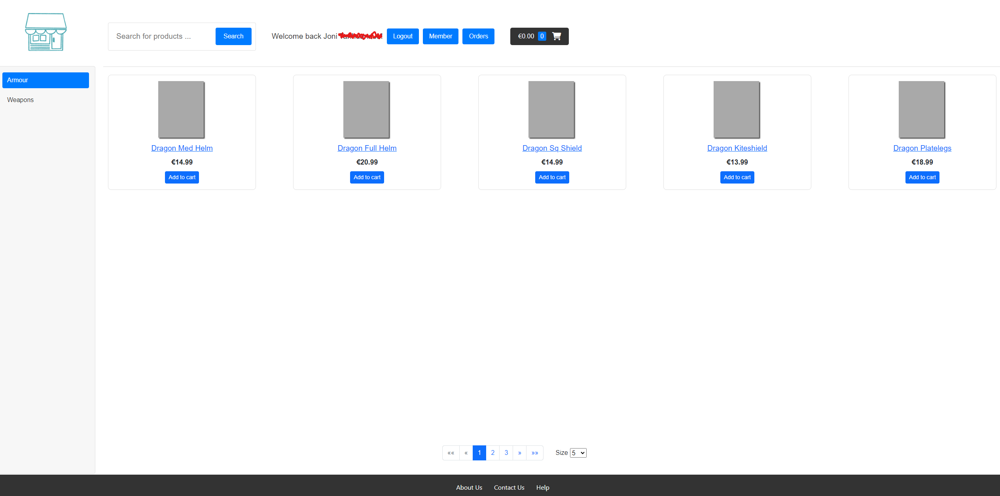
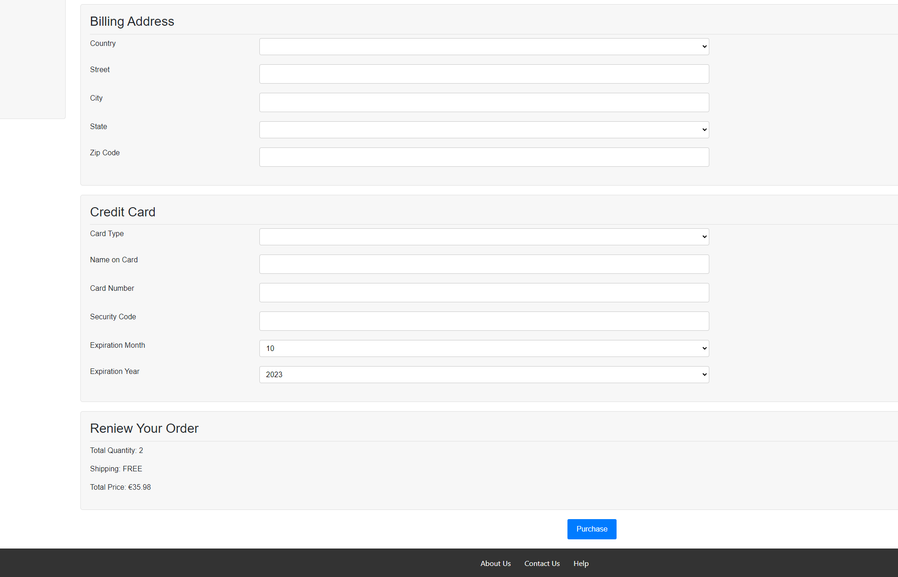
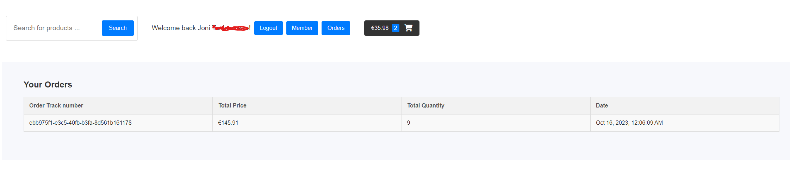

# Angular eCommerce Shop

Angular & Java Spring. README will be supplemented/changed later with...

In the application, among other things:

- The user can edit orders.
- The user can view order history.
- The user can log in and out using OKTA.
- The user can search for products.
- The user can select products and place orders.

Will be supplemented/changed later with:

- instructions on how to run
- what is further development, shortcomings, etc.
- used applications, technologies, etc. will be supplemented

#### Used applications / technologies (to be supplemented)

- Angular, Java Spring Boot, MySQL, Okta, Git Bash, Visual Studio Code, IntelliJ, MySQL server, MySQL Workbench..

### Images

Note! Styling is messed up for now.. It will be fixed..

